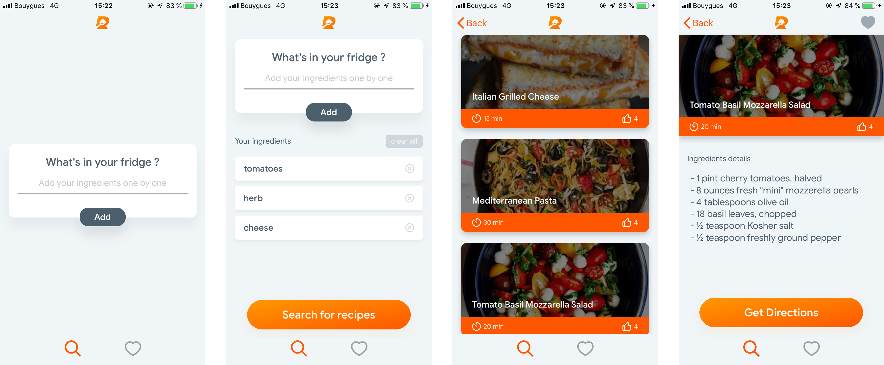

# Créer une application de recettes de cuisine

## Attention !

L'API Yummly n'est plus disponible :
```
We’re writing to inform you that the Yummly Recipe API will cease operation effective September 30, 2019. Your access to the Yummly Recipe API will continue until September 30, 2019, according to the API Terms in providing ample time for your transition.
```

## Compétences à aquérir

- Comprendre et utiliser le delegate paIern
- Sauvegarder des données avec Core Data
- Gérér une TableView
- Utiliser une lib open source (AlamoFire) et l'installer via Cocoapods

## Bonus perso

- Redesign de l'app
- Supprimer les ingrédients un par un
- SwiftLint et OHHTTPStubs

## Screenshots de l'app



